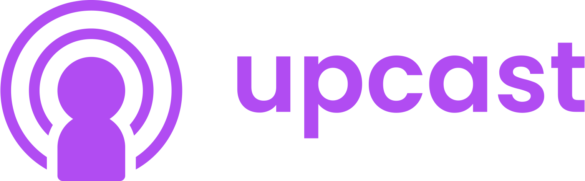
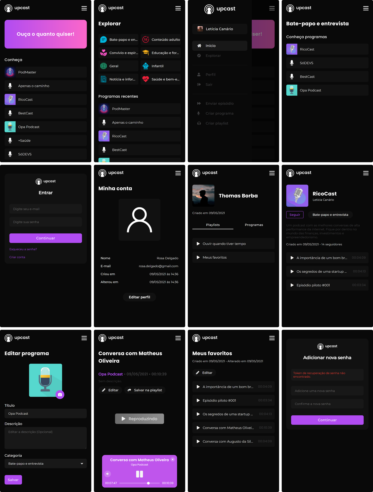

<p align="center">
  
</p>
<br>
<br>

# Upcast
Este repositório faz parte do projeto Upcast, uma plataforma fictícia de podcasts, semelhante ao Spotify e que foi construído com o uso da API [Upcast](https://github.com/willaug/upcast-api).

<br>



<br>

## Visão geral
Como projeto de portfólio, desenvolvi um aplicato web moderno que visa o streaming de áudio, especificamente podcasts. Nele é possível consumir a maior quantidade de funções da **API Upcast**.
Caso deseja entrar em contato:
- E-mail: william.santos315@outlook.com

## Funcionalidades
- Criar e alterar conta de usuário (Inclusive imagem);
- Recuperar conta de usuário;
- Login via armazenamento local (Local storage);
- Encontrar perfil de usuário;
- Encontrar categorias;
- Criar e alterar programas (Inclusive imagem);
- Encontrar programas;
- Encontrar programas por categorias;
- Seguir programas;
- Exibir quantidade de seguidores de um programa;
- Criar e alterar episódios (Com áudio);
- Criar e alterar playlists;
- Adicionar episódios a playlists;
- Reproduzir episódios em um componente independente, que permite continuar sua navegação no aplicativo enquanto ouve o conteúdo.

## Instalação
### Pré-requisitos

Para o projeto ser executado, é necessário ter o NodeJS 10+ instalado em sua máquina, além de seguir os procedimentos da **API**, caso não a tenha: [Acessar repositório da API](https://github.com/willaug/upcast-api).

### Preparando o ambiente
**Baixando repositório**
```
$ git clone https://github.com/willaug/upcast.git
$ cd upcast
```

**Dependências**
```
$ yarn
``` 
ou
```
$ npm i
```

### Endereço da API
O endereço da API está registrado como uma variável de ambiente e se encontra no arquivo **.env** na **pasta raiz** do projeto, por padrão: http://127.0.0.1:3000.

### Executando o aplicativo
```
yarn serve
```
ou
```
npm run serve
```

## Ferramentas
- [NodeJS](https://nodejs.org/en/) - Servidor;
- [VueJS](https://vuejs.org/) - Framework Javascript;
- [Vue-CLI](https://cli.vuejs.org/) - Ferramenta para desenvolvimento VueJS;
- [ESLint](https://eslint.org/) - Padrão de código Javascript;
- [SASS](https://sass-lang.com/) - Linguagem de folhas de estilo;
- [Vuex](https://vuex.vuejs.org/) - Gerenciador centralizado de estado;
- [Vue Router](https://router.vuejs.org/) - Rotas dinâmicas para Vue;
- [Vue Meta](https://vue-meta.nuxtjs.org/) - Gerador de meta tags para Vue;
- [Axios](https://github.com/axios/axios) - Cliente HTTP para Javascript;
- [VWave](https://github.com/justintaddei/v-wave) - Efeito Ripple para Vue;
- [Moment](https://momentjs.com/) - Plugin de datas;
- [Jwt-decode](https://www.npmjs.com/package/jwt-decode) - Decodificador de JWT.

